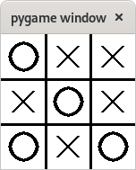
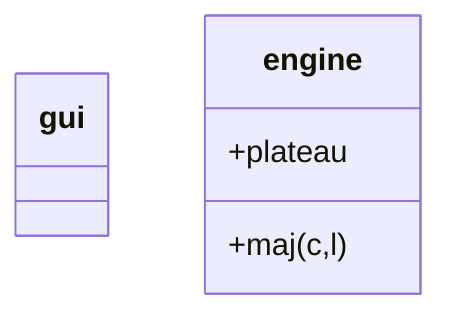
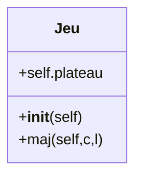
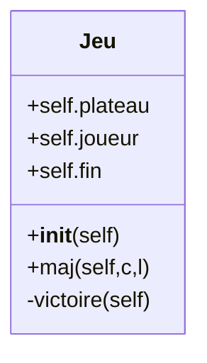

# Jeu du Tic Tac Toe - version monoposte



## I. Phase de réflexion

Le jeu est construit autour de 2 modules:



(`engine` sera transformé en *classe*, dans un second temps)

Quelques précisions:

- Variable `plateau`: liste 2D indiquant le contenu de chaque cellule de jeu
  
  - 0: cellule vide.
  
  - 1: cellule occupée par une croix (=joueur 1).
  
  - 2: cellule occupée par un cercle (=joueur 2).

- Fonction `maj(c,l)`: met à jour le contenu de `plateau` suite à coup.
  
  - `c`: index de la colonne jouée (0, 1 ou 2).
  
  - `l`: index de la ligne jouée (0, 1 ou 2).

## II. Gestion de l'interface graphique

L'objectif est de:

- gérer la fenêtre principale,

- préparer les éléments graphiques (arrière-plan, pièces...),

- dessiner le contenu courant du plateau (stocké dans le module `engine`),

- récupérer et analyser les clics de la souris pour appeler la fonction `maj()`.

### 1. Introduction

On récupère la structure de base d'une application *pygame*:

```python
import pygame

# Constante
WIDTH,HEIGHT = 800, 600

# Démarrer la bibliothèque
pygame.init()

# Définir la taille de la fenêtre en pixels
screen = pygame.display.set_mode((WIDTH,HEIGHT))

# Horloge pour contrôler le fps
clock = pygame.time.Clock()

# Boucle principale
continuer = True
while continuer:
  # Gestion des évènements
  # (comme la fermeture de la fenêtre)
  for e in pygame.event.get():
    if e.type == pygame.QUIT:
      continuer = False

  ##############################
  # Mises à jour des propriétés
  # du contenu


  #########################
  # Dessin du contenu


  #########################  
  # raffraichir l'affichage
  pygame.display.flip()

  # fps: ici 30 image par seconde
  clock.tick(30)

# Terminer l'application
pygame.quit()
quit()
```

On ajoute l'importation du module `engine`:

```python
from engine import *
```

et on modifie/déclare les diverses constantes du programme:

```python
# Constantes
WIDTH, HEIGHT = 150, 150 # dimensions de la fenêtre
BLANC = (255,255,255)
NOIR = (0,0,0)
```

### 2. Préparation des éléments graphiques

Il s'agit d'images (`Surface` dans *pygame*)

- L'arrière-plan (il occupe toute la fenêtre):

```python
# Arrière-plan
bg = pygame.Surface( (WIDTH, HEIGHT) )
bg.fill(BLANC)
pygame.draw.line(bg, NOIR, (0,HEIGHT/3), (WIDTH,HEIGHT/3), 3)
pygame.draw.line(bg, NOIR, (0,2*HEIGHT/3), (WIDTH,2*HEIGHT/3), 3)
pygame.draw.line(bg, NOIR, (WIDTH/3,0), (WIDTH/3,HEIGHT), 3)
pygame.draw.line(bg, NOIR, (2*WIDTH/3,0), (2*WIDTH/3,HEIGHT), 3)
```

* le motif de croix (la taille d'une cellule moins 2 px sur les 4 côtés pour ne pas effacer le quadrillage):

```python
w = WIDTH/3-4
h = HEIGHT/3-4
# Motif de croix
croix = pygame.Surface( (w,h) )
croix.fill(BLANC)
pygame.draw.line(croix, NOIR, (w/4, h/4), (3*w/4, 3*h/4), 3)
pygame.draw.line(croix, NOIR, (w/4, 3*h/4), (3*w/4, h/4), 3)
```

- le motif du cercle (la taille d'une cellule moins 2 px sur les 4 côtés pour ne pas effacer le quadrillage):

```python
# Motif de cercle
cercle = pygame.Surface( (w,h) )
cercle.fill(BLANC)
pygame.draw.circle(cercle, NOIR, (int(w//2), int(h//2)), int(3*w//8), 3)
```

### 3. Dessiner le contenu du plateau

La variable `plateau` est directement accessible (grâce à l'instruction d'importation en début de programme). On parcourt chaque cellule à l'aide de 2 boucles `for` imbriquées. Il y a 3 cas à considérer selon la valeur de la cellule:

- 0 : rien à dessiner

- 1 : placer une croix (`screen.blit`) à la bonne position.

- 2 : placer un cercle (`screen.blit`) à la bonne position.

Les instructions sont placées dans la boucle principale:

```python
screen.blit(bg, (0,0))
for i in range(len(plateau)):
  for j in range(len(plateau[i])):
    if plateau[i][j]==1: # une croix
      screen.blit(croix, (j*WIDTH/3+2, i*HEIGHT/3+2))
    elif plateau[i][j]==2: # un cercle
      screen.blit(cercle, (j*WIDTH/3+2, i*HEIGHT/3+2))
```

### 4. Gestion de la souris

On surveille l'événement de relâché de n'importe quel bouton de la souris (`pygame.MOUSEBUTTONUP`). Les indices de ligne et de colonne sont calculés à partir des coordonnées du clic (`x=position[0]`,  `y=position[1]`) et des dimensions de chaque cellule (`WIDTH/3` et `HEIGHT/3`).

Les instructions sont placées dans la boucle principale, à la suite du traitement de la liste d'événements:

```python
elif e.type == pygame.MOUSEBUTTONUP:
  position = e.pos
  colonne = int(position[0]//(WIDTH/3))
  ligne = int(position[1]//(HEIGHT/3))
  maj(colonne, ligne)
```

## II. Gestion du jeu

### 1. Introduction

Il n'y a rien à importer dans ce module

On initialise `plateau` et mémorise le numéro du joueur:

```python
plateau = [ [0,0,0], [0,0,0], [0,0,0] ]
joueur = 1
```

### 2. Fonction de mise à jour

Il faut vérifier si la cellule visée n'est pas occupée (si c'est le cas, on termine directement la fonction avec `return`). 

Puis on met à jour le contenu de la cellule.

Enfin, on termine en choisissant le joueur suivant (il faut déclarer la variable `joueur` en tant que `global` pour pouvoir la modifier dans la fonction)

```python
def maj(c,l):
  global joueur

  if plateau[l][c]!=0:
    return
  else:
    plateau[l][c]=joueur

    if joueur==1:
      joueur = 2
    else:
      joueur = 1
```

> Dans cette version, il manque la vérification de la fin de partie.

### 3. Utilisation de la POO

Réécrivons le module `engine` à l'aide de la *Programmation Orientée Objet* afin de le rendre plus évolutif:

- tout le code est placé dans une classe (appelée `Jeu`).

- les instructions d'initialisation sont placées dans le constructeur `__init__(self)`.

- les variables à réutiliser dans toutes les méthodes deviennent des attributs:
  
  - `plateau` &rarr; `self.plateau`
  
  - `joueur` &rarr; `self.joueur`

- La fonction `maj` devient une méthode (on lui ajoute `self` comme premier paramètre).
  
  - on utilise directement les attributs pour les instructions.
  
  - on n'a plus besoin du mot clé `global` pour modifier l'attribut.



Ce qui donne le code-source:

```python
class Jeu:
  def __init__(self):
    self.plateau = [ [0,0,0], [0,0,0], [0,0,0]]
    self.joueur = 1

  def maj(self,c,l):
    if self.plateau[l][c]!=0:
      return
    else:
      self.plateau[l][c] = self.joueur

    self.joueur = 2 - (self.joueur-1) # version plus concise
```

Les modification à apporter dans le module principal (`gui.py`):

- importation de la classe:

```python
from engine import Jeu
```

- Création du jeu:

```python
jeu = Jeu()
```

- Remplacer l'accès à `plateau[i][j]` par `jeu.plateau[i][j]`.

- Remplacer l'appel à `maj(colonne, ligne)` par `jeu.maj(colonne, ligne)`,

### 4. Finalisation du jeu

Pour obtenir une version *complète* du jeu, ajoutons une nouvelle méthode `victoire`:

- dans la classe `Jeu` du module `engine` : cette méthode sert au fonctionnement interne du jeu, elle n'a rien à voir avec les aspects graphiques.

- la méthode n'a pas d'argument (autre que `self`): elle n'a besoin que des attributs de `Jeu` .

- une victoire est détectée lorsque:
  
  - une ligne contient 3 même motifs (croix ou cercle) &rarr; 3 lignes possibles,
  
  - une colonne contient 3 même motifs (croix ou cercle) → 3 colonnes possibles,
  
  - une diagonale contient 3 même motifs (croix ou cercle) &rarr; 2 diagonales possibles.

- la méthode retourne un couple de valeur (un *tuple*):
  
  - `True` ou `False` selon que la partie est gagnée ou non
  
  - le numéro du joueur (1 ou 2) qui a gagné (0 si `False`, cette valeur n'a, de toute façon, pas d'importance dans ce cas).



> Un nouvel attribut `self.fin` a aussi été ajouté pour mémoriser le résultat du dernier appel à `self.maj`.

Les modifications à apporter dans `gui.py`:

- ne pas gérer le clic de souris dans le jeu si la partie est finie:

```python
elif e.type == pygame.MOUSEBUTTONUP and not jeu.fin[0]:
```

- modifier le titre de la fenêtre pour afficher le vainqueur (à placer dans la boucle principale):

```python
if jeu.fin[0]:
  pygame.display.set_caption("Victoire" + str(jeu.fin[1]))
```
