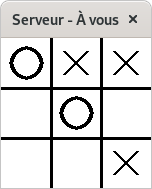
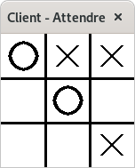

# Jeu de Tic Tac Toe (version réseau)

| `>>> python gui.py`               | `>>> python gui.py client`       |
|:---------------------------------:|:--------------------------------:|
|  |  |

# I. Préparation

Partons de la dernière version du programme de TicTacToe (mono-poste):

- `gui.py`

- `engine.py`

Comme le fonctionnement de jeu est identique côté client et côté serveur (une fois la connexion effectuée) nous n'écrivons qu'un seul programme (avec 2 fichiers `gui.py` et `engine.py`). 

Les quelques différences client/serveur sont:

- un argument supplémentaire dans la ligne de commande pour démarrer en mode client (mode serveur par défaut).
- le titre de fenêtre.
- la connexion et la première communication (détermination du premier joueur).

## 1) Arguments de la ligne de commande

La ligne de commande pour lancer le jeu version mono-poste est la suivante:

```bash
>>> python gui.py
```

Cette ligne de commande contient 2 **arguments** (les arguments sont séparés par des espaces) : `python` et `gui.py`

Nous allons prévoir un 3ème argument: `client` qui:

- s'il est absent, le jeu démarre en mode *serveur*,

- s'il est présent, le jeu démarre en mode *client*.

Le module `sys` de Python permet de récupérer la *liste* des paramètres de la ligne de commande (variable `sys.argv`):

```python
import sys

# Nombre de paramètres de la ligne de commande: 
# 2 en mode serveur, 3 en mode client
if len(sys.argv)==2:
  mode_serveur = True
elif len(sys.argv)==3 and sys.argv[2]=="client" : 
  mode_serveur = False
else:
  print("Erreur de ligne de commande")
```

Comme le choix client/serveur n'est pas spécifique à une interface graphique, nous allons gérer le paramètre `client` dans le fichier `engine.py` (début de la méthode `__init__()`. On définit un nouvel attribut `self.serveur` pour mémoriser le mode de fonctionnement:

```python
import sys
...

class Jeu():
  def __init__(self):
    # Vérification simplifiée
    if len(sys.argv)==2 and sys.argv[1]=="client":
      self.serveur = False
      print("Mode client")
    else:
      self.serveur = True
      print("Mode serveur")
    ...
    self.mon_tour = True
```

> On en profite pour créer l'attribut `self.mon_tour` qui indique si le joueur doit attendre ou jouer (initialise à `True`, pour le moment).

## 2) Titre de la fenêtre

Le titre de la fenêtre avec Pygame peut se modifier à tout moment avec l'instruction: `pygame.display.set_caption("Mon titre")` .

Pour éviter de surcharger la boucle principale du jeu, nous allons créer une nouvelle fonction dans `gui.py` pour s'occupe d'indiquer dans le titre :

- s'il s'agit du client ou du serveur (facilite les tests menés sur un même ordi),
- si c'est au tour du joueur ou s'il doit attendre.

Cette fonction a besoin du Jeu (variable `j`) en tant que paramètre pour accéder aux variables attributs `self.serveur` et `self.mon_tour`:

```python
def titre(j):
  if j.serveur:
    joueur = "Serveur"
  else:
    joueur = "Client"

  if j.mon_tour:
    pygame.display.set_caption(joueur + " - À vous")
  else:
    pygame.display.set_caption(joueur + " - Attendre")
```

L'appel de cette fonction, s'effectue depuis la boucle principale:

```python
################################
# Mise à jour du des propriétes
# du contenu
titre(jeu)
```

> À ce stade, si on lance le serveur et le client, on obtient 2 fenêtres avec des jeux indépendants:

| `>>> python gui.py`            | `>>> python gui.py client`    |
|:------------------------------:|:-----------------------------:|
|  |  |

## 3) Connexion et premier joueur

Comme vu dans le TP sur les communications réseau:

- le serveur:
  
  1. Met en place une *socket d'écoute* et attend le client.
  
  2. Une fois le client  connecté, il créé sa **socket locale** (attribut `self.local_socket`) pour communiquer.

- le client créé sa **socket locale** (attribut `self.local_socket`) en se connectant au serveur sur le port dédié.

Les 2 modes de fonctionnement sont gérés dans la méthode `__init()__` du fichier `engine.py`:

```python
import socket
...

def __init__(self):
  ...
  if self.serveur: # Mode serveur
    listen_socket = socket.socket(socket.AF_INET, socket.SOCK_STREAM)
    listen_socket.setsockopt(socket.SOL_SOCKET, socket.SO_REUSEADDR, 1)
    listen_socket.bind( ('', 7175) ) # 7175: valeur arbitraire
    listen_socket.listen(1) # Attendre 1 seul client
    print("Attente du client...")

    self.local_socket, remote_socket = listen_socket.accept()
    print("Connecté avec", remote_socket)
  else: # Mode client
    self.local_socket = socket.socket(socket.AF_INET, socket.SOCK_STREAM)
    self.local_socket.connect(('127.0.0.1', 7175))
    remote_socket = self.local_socket.getpeername()
    print("Connecté avec", remote_socket)
```

Une fois connectés, le serveur va tirer au sort (utilisation du module `random`) le premier joueur à jouer (1 ou 2) et envoyer l'autre numéro au client (création du nouvel attribut `self.joueur`) :

```python
import random
...

def __init__(self):
  ...
  # 1ère communication (détermination 1er joueur)
  if self.serveur: # Le serveur choisit et envoit le résultat
    if random.random()>0.5: # valeur entre 0 et 1
      self.joueur = 1
      adversaire = '2'
    else:
      self.joueur = 2
      adversaire = '1'
    # Envoi d'un octet
    message = bytes(adversaire, 'ascii') # conversion en octet
    self.local_socket.sendall(message)
  else: # le client reçoit son numéro de joueur
    # Réception d'1 octet
    message = self.local_socket.recv(1)
    self.joueur = int(message.decode('ascii')) # conversion ascii puis int
```

À partir de maintenant, le client et le serveur ont exactement le **même rôle**.

On finit cette phase de préparation en mettant à jour l'attribut `self.mon_tour`:

```python
if self.joueur==1:
  self.mon_tour = True
else:
  self.mon_tour = False
print('Joueur', self.joueur)
```

> Pour n'autoriser que le joueur qui a la main à jouer, il faut modifier la gestion du clic de souris (avant l'appel de la méthode `maj`):
> 
> ```python
> if jeu.mon_tour: # test à rajouter
>   jeu.maj(colonne, ligne)
> ```
> 
> À ce stade,  les 2 jeux doivent avoir des joueurs distincts et 1 seul joueur (toujours le même) peut jouer.

| `>>> python gui.py`            | `>>> python gui.py client`    |
|:------------------------------:|:-----------------------------:|
|  |  |

# II. Communication réseau durant le jeu

La communication est de type *ping-pong*:

- lorsque joueur local effectue un coup, il l'envoie (*écriture* sur la *socket locale*) pendant que l'autre écoute (*lecture* de la *socket locale*).

- les joueurs jouent chacun à leur tour (par d'écriture ni de lecture simultanées)

Cependant, la *lecture* et l'*écriture* sont des opérations **bloquantes**: le programme est stoppé tant que l'opération n'est pas terminée.

- Il n'y a pas de soucis avec l'écriture, car:
  
  - elle est déterministe (elle s'effectue dès que le joueur local a joué), 
  
  - elle est quasi instantanée (il n'y a que 2 octets à transmettre) et 
  
  - on peut considérer que le réseau est toujours disponible (sur un PC).

- Ce n'est pas le cas pour la lecture: il faut attendre (parfois longtemps) que  l'adversaire ait fini de jouer.

> Conséquence du blocage: la boucle Pygame est stoppée, il n'y a plus de rafraîchissement et l'affichage ne répond plus.

Une solution a ce problème est d'effectuer l'opération de lecture dans un deuxième *fil d'exécution* (un nouveau **thread**).

## 1) Notion de Thread

On les appelle aussi **processus légers**. Ce sont des parties de code, d'un même programme, qui peuvent s'exécuter en *parallèle*. Il existe toujours, au minimum, un *thread* dans un programme (le *thread* principal).

> L'ajout de nouveaux *threads* peut s'avérer délicat surtout s'ils accèdent ou modifient des données communes: une donnée peut être modifiée **dans le même temps** qu'elle est consultée (on parle de *concurrence d'accès*).
> On peut parfois aboutir à un fonctionnement complètement erratique du programme.
> Pour nous simplifier la tâche, nous **ignorerons** volontairement ce problème en Terminale ISN.

Un *thread* peut s'obtenir depuis une nouvelle classe et l'utilisation du module `threading`:

```python
import threading

class MonThread(threading.Thread):
  def __init__(self):
    threading.Thread.__init__(self)

  def run(self):
    # Instructions à exécuter 
    # dans le nouveau Thread
```

Pour créer et lancer le *thread*:

```python
t = MonThread() # création
t.start() # lancer le thread
```

> Un fois lancé, le *thread* se termine dès qu'il a fini d'exécuter les instructions qui se trouvent dans la méthode `run()`

## 2) Thread de lecture

Dans notre cas:

- nous allons mettre en place une boucle de lecture *sans fin* dans la méthode `run()`. 

- Pour terminer le *thread* (en fin de partie), nous ajoutons une méthode `stop()` et un attribut booléen `self.continuer`.

- nous réutilisons la *socket locale* qui a déjà servi à la première communication (le choix du 1er joueur). 
  Cette dernière sera donc fourni lors de la construction (via `jeu`) et mémorisée dans l'attribut `self.socket`.

- pour simplifier les importations de modules, nous plaçons le code du *thread* directement dans le fichier `engine.py` (la lecture n'est pas spécifique à l'interface graphique, elle peut aussi servir à une version console du jeu).

Voici les extraits de code correspondants:

```python
import threading
...

class Jeu():
  def __init__(self):
    ...
    # Après la 1ère communication
    self.reception = Reception(self) # envoi du jeu au Thread
    self.reception.start() # démarrer le thread

class Reception(threading.Thread):
  def __init__(self, j): # j correspond au jeu
    threading.Thread.__init__(self)
    self.jeu = j # mémorisation
    self.continuer = True # pour la boucle sans fin

  def stop(self): # méthode pour arrêter la boucle sans fin
    self.continuer = False

  def run(self): # instructions à exécuter dans le thread
    while self.continuer:
      # Attendre de recevoir 2 caractères (colonne + ligne du coup)
      message = self.jeu.local_socket.recv(2)
      recu = message.decode('ascii') # convertir en chaîne
      self.jeu.maj(int(recu[0]), int(recu[1])) # colonne, ligne (entiers)
```

## 3) Finalisation du jeu

La méthode `maj` est appelée dès qu'un joueur a joué:

- joueur local: l'appel est fait depuis la gestion du clic de souris

- joueur distant: l'appel est fait après une communication réseau.

La méthode `maj` doit donc:

- mémoriser le coup dans `self.plateau` (avec le bon numéro de joueur)

- envoyer le coup (colonne + ligne dans une chaîne à l'adversaire) s'il s'agit d'un coup local.

- Vérifier la victoire:
  
  - si oui, enlever la main aux 2 joueurs et arrêter la réception)
  
  - si non: identifier le joueur suivant à avoir la main.

```python
def maj(self, c, l):
  if self.plateau[l][c]!=0: # case non libre
    return
  else: # case libre
    if self.mon_tour: # joueur local
      self.plateau[l][c] = self.joueur
      # envoyer à l'adversaire
      message = str(c) + str(l)
      self.local_socket.sendall(bytes(message, 'ascii'))
    else: # joueur distant
      self.plateau[l][c] = 2 - (self.joueur-1)

  # Victoire ?
  self.fin = self.victoire()
  if self.fin[0]: # Victoire
    self.mon_tour = False # enlever la main
    self.reception.stop() # arrêter la réception
  else: # Passer au joueur suivant
    self.mon_tour = not self.mon_tour
```
